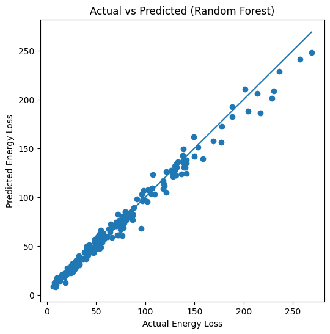
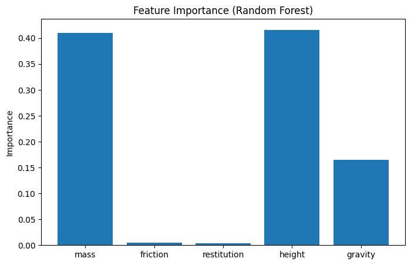

# 📊 Data Generation using Modelling and Simulation for Machine Learning  
### (PyBullet-based Physics Simulation)

---

## 📌 Assignment Overview

This project demonstrates **synthetic data generation using modelling and simulation**, followed by **machine learning model evaluation**.  
A physics-based simulator (**PyBullet**) is used to generate data under controlled conditions, which is then used to train and compare multiple machine learning models.

The complete workflow is implemented using **Google Colab** and the results are hosted on **GitHub**, as required.

---

## 🛠 Simulation Tool Used

### **PyBullet – Physics Simulation Engine**

PyBullet is an open-source physics engine widely used for rigid body dynamics, robotics, and reinforcement learning research.  
It enables accurate modelling of physical interactions such as gravity, friction, collision, and energy dissipation.

**Why PyBullet?**
- Fully Python-based
- Compatible with Google Colab
- Produces continuous numerical outputs
- Suitable for machine learning data generation

---

## 🧪 Simulation Description

### Scenario  
A rigid cube is dropped from a specified height onto a flat surface under varying physical conditions.  
The simulation captures how physical parameters influence **energy loss during impact and motion**.

---

## 🔧 Simulation Parameters & Bounds

| Parameter | Description | Lower Bound | Upper Bound |
|--------|------------|-------------|-------------|
| mass | Mass of cube (kg) | 0.5 | 5.0 |
| friction | Surface friction coefficient | 0.1 | 1.0 |
| restitution | Coefficient of restitution | 0.0 | 0.9 |
| height | Initial drop height (m) | 0.5 | 5.0 |
| gravity | Gravitational acceleration (m/s²) | 5 | 15 |

---

## 🎯 Output Variable (Target)

- **Energy Loss (Joules)**  
Energy loss is computed as the difference between initial potential energy and final resting potential energy.

---

## 🔁 Data Generation Methodology

1. Randomly generate simulation parameters within defined bounds
2. Run PyBullet simulation in DIRECT (headless) mode
3. Compute energy loss for each simulation
4. Store inputs and outputs in a structured dataset
5. Repeat the process for **1000 simulations**

---

## 📂 Generated Dataset

- 📄 **CSV File:**  
  👉 [`pybullet_simulation_data.csv`](./pybullet_simulation_data.csv)

### Dataset Columns

| Column | Description |
|-----|------------|
| mass | Cube mass |
| friction | Friction coefficient |
| restitution | Restitution coefficient |
| height | Drop height |
| gravity | Gravity |
| energy_loss | Target variable |

---

## 🤖 Machine Learning Models Used

The problem is formulated as a **regression task**.

The following models were trained and evaluated:

- Linear Regression  
- Ridge Regression  
- Lasso Regression  
- Decision Tree Regressor  
- Random Forest Regressor  
- Gradient Boosting Regressor  
- Support Vector Regressor (SVR)

---

## 📊 Evaluation Metrics

Each model is evaluated using:

- **MAE (Mean Absolute Error)**
- **RMSE (Root Mean Squared Error)**
- **R² Score**

---

## 📈 Results & Visualizations

### 🔹 Model Comparison (RMSE)

[.png)](Graphs/Model_Comparison(RMSE).png)

This graph compares the RMSE values of different machine learning models trained on the simulation-generated dataset.  
Lower RMSE indicates better predictive performance.

---

### 🔹 Best Model: Actual vs Predicted

[](Graphs/Best_Model.png)

The scatter plot shows the relationship between actual and predicted energy loss values for the best-performing model (**Random Forest Regressor**).  
The closer the points lie to the diagonal line, the better the model’s prediction accuracy.

---

### 🔹 Feature Importance (Best Model)

[](Graphs/Best_Feature.png)

This plot highlights the relative importance of each input parameter in predicting energy loss.  
It provides interpretability by showing which physical parameters most influence the outcome.

---

## 🏆 Best Performing Model

- **Model:** Random Forest Regressor  
- **Reason:** Lowest RMSE and highest R² score  
- **Insight:** Non-linear ensemble models perform better for physics-based simulation data

---

## 📓 Notebook

The complete implementation including:
- Simulation code
- Data generation
- ML training & evaluation
- Graph generation  

👉 **Colab Notebook:**  
[`Data_Generation.ipynb`](./Data_Generation.ipynb)

---

## 📁 Repository Structure

```text
 ┣ 📓 Data_Generation.ipynb
 ┣ 📊 pybullet_simulation_data.csv
 ┣ 📁 Graphs
 ┃ ┣ 📈 Model_Comparison(RMSE).png
 ┃ ┣ 📈 Best_Model.png
 ┃ ┗ 📈 Best_Feature.png
 ┣ 📄 README.md
```
---
## ✅ Conclusion

This project demonstrates how **physics-based simulations** can be effectively used to generate high-quality synthetic datasets for machine learning applications.  
By leveraging the PyBullet physics engine, realistic physical interactions such as gravity, friction, and restitution were modeled under controlled conditions.

The generated dataset enabled the training and evaluation of multiple regression-based machine learning models.  
Among the evaluated models, ensemble-based approaches—particularly the **Random Forest Regressor**—achieved the best performance, highlighting their ability to capture non-linear relationships inherent in physical systems.

Overall, this work shows that simulation-driven data generation is a powerful alternative when real-world data is expensive, limited, or difficult to obtain.

---

## 🔮 Future Work

- Extend the simulation to **multi-object interactions**
- Predict additional physical quantities such as:
  - Impact velocity
  - Time to stabilization
  - Final displacement
- Apply **deep learning models** for improved prediction accuracy
- Introduce noise and uncertainty to better mimic real-world conditions
- Explore reinforcement learning on the same simulated environment

---

## 👤 Author

**Sameer Rai**

---
